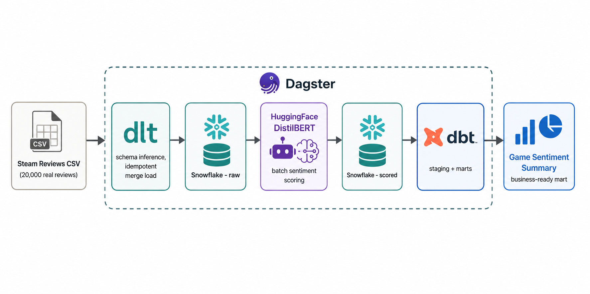

# Steam Review Sentiment Pipeline

An NLP pipeline that ingests real Steam game reviews via **dlt**, scores
each review's sentiment with a HuggingFace transformer model, transforms
the results with **dbt** into game-level sentiment summaries, and
orchestrates the whole thing with **Dagster**.

## Why this project

- **dlt for ingestion**, not a hand-rolled loader - automatic schema
  inference, idempotent merge loading (re-running doesn't duplicate rows,
  verified against the real 20,000-row dataset), and built-in schema
  evolution tracking.
- **A real transformer model for sentiment**, not a keyword/lexicon
  heuristic - `distilbert-base-uncased-finetuned-sst-2-english`, a
  well-established pretrained model, applied in batches.
- **Sentiment vs. stated recommendation mismatch detection** in the fact
  table (`fct_reviews.sql`) - flags reviews where Steam's binary
  Recommended/Not-Recommended vote disagrees with what the model reads in
  the actual text. This is the kind of derived signal that makes a
  sentiment pipeline actually useful, not just a label-adding exercise.
- **Ties into the existing `gaming-analytics-pipeline` repo** thematically -
  that project analyzes what Steam's API reports about games (player
  counts, pricing); this one analyzes what users actually say about them.
  Same platform, two different angles.

## Architecture

*(Diagram generated separately - see the prompt below if you want to
regenerate or adapt it.)*



<details>
<summary>Prompt used to generate the architecture diagram</summary>

```
Create a clean, professional data engineering architecture diagram in a flat
modern tech-illustration style (like official AWS architecture diagrams).
Horizontal left-to-right flow on a white or light gray background.

Components, left to right:
1. A spreadsheet/CSV icon labeled "Steam Reviews CSV" (20,000 real reviews)
2. An arrow into a box labeled "dlt" (subtitle: schema inference, idempotent merge load)
3. An arrow into a database icon labeled "Snowflake - raw" 
4. An arrow into a box labeled "HuggingFace DistilBERT" (subtitle: batch sentiment scoring) with a small robot/brain icon
5. An arrow into a second database icon labeled "Snowflake - scored"
6. An arrow into a box labeled "dbt" (subtitle: staging + marts) with the dbt logo
7. An arrow into a final box labeled "Game Sentiment Summary" (subtitle: business-ready mart)

Wrap steps 2 through 6 in a dashed rounded rectangle labeled "Dagster" with
the Dagster logo near the label, since Dagster orchestrates the whole chain.

Use a professional color palette: gray/tan for the raw source, teal for dlt
and the raw Snowflake table, purple for the HuggingFace model box (to stand
out as the ML/NLP step), and blue for dbt and the final mart. Clean
sans-serif typography, minimal shadows, suitable as a GitHub README hero image.
```

</details>

## Evidence

Screenshots proving this runs against real data and real infrastructure,
not just written but never executed:

| | |
|---|---|
|  | dlt loading 20,000 real reviews, verified idempotent on re-run |
|  | HuggingFace model scoring reviews in batches |
|  | raw and scored tables in Snowflake |
|  | dbt building staging + mart models, tests passing |
|  | raw → scored → dbt marts pipeline in Dagster |
|  | Full test suite passing |

## Dataset

A real Steam reviews dataset (20,000 reviews across several popular games:
PUBG, GTA V, Rust, Rocket League, and others), sourced from
[mrafifrbbn/steam-reviews](https://github.com/mrafifrbbn/steam-reviews),
itself a curated subset of a larger Kaggle Steam reviews dataset. No PII -
review text and metadata only, no usernames.

A 1,000-row sample is committed at `data/steam_reviews_sample.csv` for quick
local testing; the full file is gitignored - see `data/README.md`.

## Stack

| Layer | Tool |
|---|---|
| Ingestion | dlt (data load tool) |
| Sentiment model | HuggingFace Transformers (DistilBERT) |
| Warehouse | Snowflake |
| Transformation | dbt |
| Orchestration | Dagster |
| CI | GitHub Actions (pytest + dbt parse) |

## Repo structure

```
├── src/
│   ├── ingest.py             # dlt: raw CSV -> Snowflake raw table (idempotent merge)
│   ├── sentiment.py          # HuggingFace DistilBERT batch scoring
│   └── data_quality.py       # Named, fail-loud quality checks
├── dbt/steam_sentiment/
│   ├── models/staging/       # stg_steam_reviews
│   └── models/marts/         # fct_reviews, mart_game_sentiment_summary
├── dagster_project/
│   └── definitions.py        # raw -> scored -> dbt marts assets
├── tests/test_pipeline.py     # pytest suite (mocked model, no network needed)
└── .github/workflows/ci.yml
```

## Running it

### 1. Get the dataset

```bash
mkdir -p data
curl -sL -o data/steam_reviews.csv "https://raw.githubusercontent.com/mrafifrbbn/steam-reviews/main/data/steam_reviews.csv"
```

### 2. Set up Snowflake connection

```bash
export SNOWFLAKE_ACCOUNT=nk97257.eu-central-2.aws   # reusing the account from gaming/sports-analytics-pipeline
export SNOWFLAKE_USER=MARWAELHUSSIENY
export SNOWFLAKE_PASSWORD=...
```

dlt also needs credentials in its own format - create `.dlt/secrets.toml`:
```toml
[destination.snowflake.credentials]
database = "STEAM_SENTIMENT"
username = "MARWAELHUSSIENY"
password = "..."
host = "nk97257.eu-central-2.aws"
warehouse = "COMPUTE_WH"
role = "ACCOUNTADMIN"
```

### 3. Run the pipeline

```bash
pip install -r requirements.txt

python src/ingest.py snowflake
python src/sentiment.py
```

### 4. Run dbt

```bash
cp dbt/steam_sentiment/profiles.yml.example ~/.dbt/profiles.yml
# edit ~/.dbt/profiles.yml with real values, or export the env vars it references

cd dbt/steam_sentiment
dbt build
```

### 5. Or orchestrate with Dagster

```bash
pip install dagster dagster-webserver
dagster dev -f dagster_project/definitions.py
```

### 6. Tests

```bash
pytest tests/ -v
```

## What I'd add with more time

- Fine-tune the sentiment model on a labeled subset of these exact reviews
  (using the `recommendation` column as weak labels) instead of using the
  off-the-shelf SST-2 model as-is
- A small Streamlit app showing the sentiment/recommendation mismatch
  reviews - genuinely interesting to read
- Expand to the full Kaggle dataset (400K+ reviews) instead of the 20K subset

---
*Part of a modernized 10-project data engineering portfolio, upgrading the
original brief from [garage-education/data-engineering-projects](https://github.com/garage-education/data-engineering-projects).*
